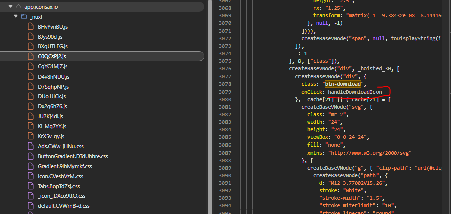
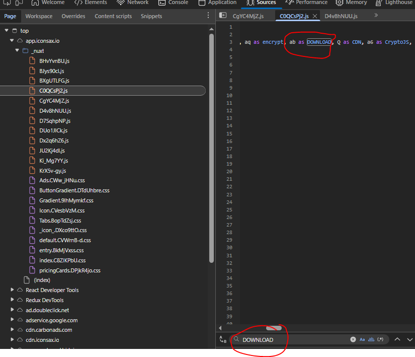
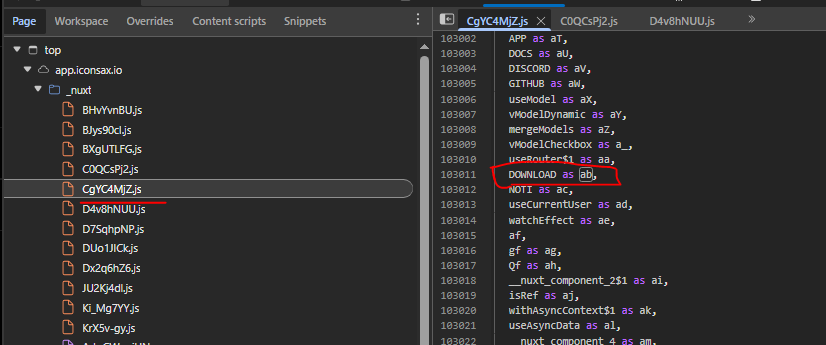

## Iconsax Free Pack Downloader

Small Node.js script that mirrors the **free** Iconsax catalog by walking their public manifest, downloading each encrypted SVG, decrypting it locally, and writing the plain assets to `icons/`.

### How It Works

- Fetch all 10 manifest parts from `https://cdn.iconsax.io/icons_parts/icons_part_{n}.json`.
- Filter entries where `tier === "free"` so we only mirror the free icons.
- For every free icon, download the encrypted blob from `https://cdn.iconsax.io{icon.url}`.
- Decrypt the AES-encrypted Base64 payload using the shared key `123qwe`.
- Save the resulting SVG as `{icon.name}.svg`, appending `-1`, `-2`, … if a name repeats.

See `main.js` for the full implementation.

### Prerequisites

- Node.js 18+ (HTTPS fetch + modern syntax)
- npm dependencies installed:

```
npm install
```

### Usage

```
node main.js
```

The script logs its progress (manifests fetched, icons downloaded) and writes all decrypted SVGs into `icons/`. Expect a few thousand files—make sure you have a stable connection and sufficient disk space.

### Notes

- The AES key (`123qwe`) comes from publicly distributed encrypted samples and is hard-coded for simplicity.
- Duplicate names in the manifest receive numeric suffixes to avoid overwriting files.
- Failed downloads or decryptions are logged and skipped so the batch can continue.

### How the AES key was found

**Verify behavior in the browser**: free icons render as real SVGs when inspected, yet the download response body is an opaque Base64 string like `U2FsdGVkX194dJmg4lj...`. That means the payload is encrypted server-side and decrypted on the frontend, so the key has to exist somewhere in the bundled source.

1. Open the free icon detail page and use DevTools → Network. The download request returns data that clearly isn’t raw SVG, confirming the suspicion above.

2. Inspect the DOM for the download button (`id="btn-download"`). That identifier will also appear in the bundled Nuxt sources.

3. In Sources → `app.iconsax.io/_nuxt/*.js`, search for `btn-download` to locate the file containing the click handler
   

4. Follow the `handleDownloadIcon` logic (see `assets/2.handle-download-icon-func.PNG`). For plain SVGs it falls through to an internal `DOWNLOAD` helper.
   

5. Track the `DOWNLOAD` import (`import { ..., ab as DOWNLOAD, ... } from "./CgYC4MjZ.js";`) and jump to that bundle (`assets/3.trace-download-func.PNG`, `assets/4.download-func-location.PNG`).
   
   

6. Inside the exported `DOWNLOAD` function (`assets/5.download-func-content.png`), the AES key literal `123qwe` is used to decrypt the blob before triggering the browser download.


